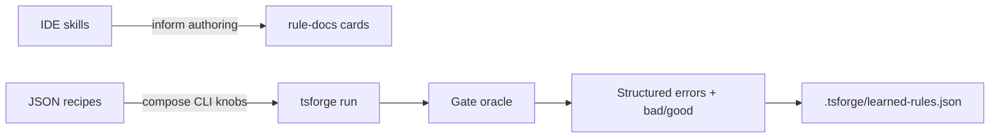

tsforge is **enforcement-first**. During a run, the harness does not load `SKILL.md` files. Instead it uses deterministic gates, [rule packs](/guardrails/rule-packs/), and [bad/good feedback cards](/loop/validation/) to tell the model what failed and how to fix it.

**Agent skills** are a separate layer for maintainers and IDE workflows: release, harness audits, skill authoring. They live in the repo under `.claude/skills/` and are discovered by Claude Code / compatible agents at session start.

## Two layers

| Layer | What it does | Where it lives |
| --- | --- | --- |
| **Harness** | Enforces invariants; work is not done until the gate passes | `packages/core/` (rule packs, meta-rules, gate, `rule-docs`) |
| **Skills** | Repeatable procedures for humans/agents outside the run loop | `.claude/skills/<category>/<name>/SKILL.md` |



Skills **inform** how you write rules and docs. They do **not** replace the gate.

## Skill categories in this repo

```
.claude/skills/
├── harness/     harness-review (adversarial subsystem audit)
├── release/     tsforge-release (npm + GitHub release)
└── authoring/   effective-tsforge-skills (how to write skills here)
```

Each skill folder name must match its frontmatter `name`. See `effective-tsforge-skills` for the ship checklist.

## When to use what

| Need | Use |
| --- | --- |
| Must hold before "done" | ESLint rule, meta-rule, or gate check |
| Fix guidance on failure | `IRuleDoc` in `rule-docs.ts` (what + bad + good + optional procedure) |
| Named run setup | [Recipe](/cli/recipes/) JSON (gate, files, model, `profile`, flags) |
| Maintainer workflow | Skill under `.claude/skills/` |
| User-facing product behavior | [Docs site](/) page |

Do not put enforceable invariants only in a skill. If the model must not ship without it, encode it in the gate.

## Recipes vs skills

[Recipes](/cli/recipes/) compose **existing CLI options**: gate, scope, models, `profile`, plan mode, greenfield. They are data (`*.json`), not procedures.

Skills compose **methodology**: repro-before-report harness reviews, release scripts with failure modes. A recipe might set `profile: "strict"`; a skill teaches how to run `bun run validate` before tagging.

## Learned rules

tsforge mines gate failure→fix pairs into [`.tsforge/learned-rules.json`](/uplift/memory/) and promotes recurring patterns to TTSR triggers. These are repo-local "micro-skills": machine triggers, not markdown runbooks. High-confidence patterns can later be promoted to committed `IRuleDoc` entries or maintainer skills.

→ [Recipes](/cli/recipes/) · [Rule packs](/guardrails/rule-packs/) · [When the gate fails](/loop/validation/) · [Contributing](https://github.com/boringstack-xyz/tsforge/blob/main/CONTRIBUTING.md)
