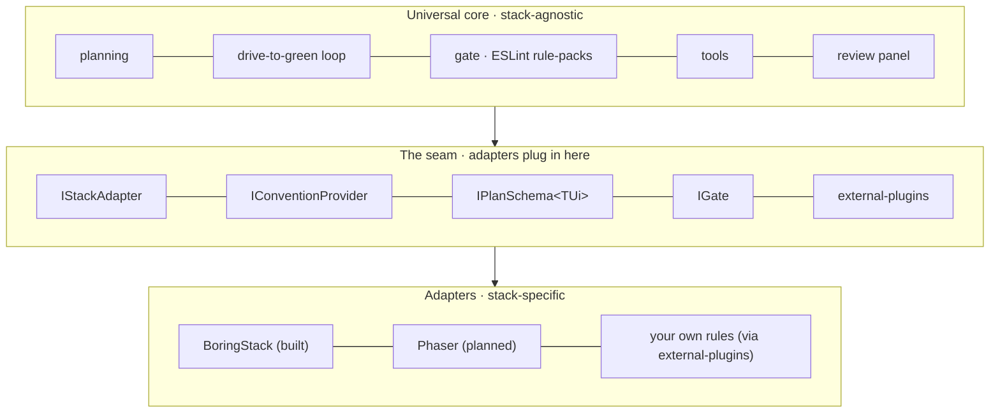
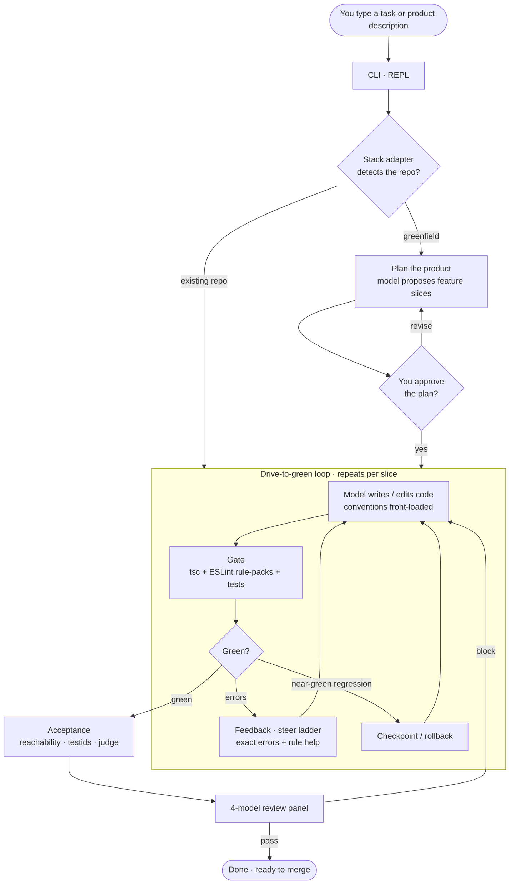

tsforge is a **TypeScript coding harness**. It sits between you and a model, runs edits in your repo, and keeps asking the model to fix things until your project passes a real check. It is not an editor plugin. You point it at a folder, give it a task, and it drives file changes plus validation until the gate is green or the loop stops.

If you already ran the [Quickstart](/quickstart/), this page explains what you just turned on.

**How to read the docs:** start here, then [How the gate is built](/loop/gate-floor/) when "what counts as done?" is unclear. Use the glossary below when a term looks unfamiliar. Eval and spec pages are for benchmark contributors, not required for day-to-day use.

## How it's layered

tsforge is built as **one general core plus adapters**. The engine (write, check, steer, repeat) is the same for any TypeScript project. Everything stack-specific (how to scaffold a new app, what a given error *means*, how to verify a feature works) lives in an **adapter** that plugs into a fixed set of seams. The core imports nothing from an adapter; a lint rule fails the build if it tries.

An **adapter** is exactly: fill those interfaces. `IStackAdapter` detects a repo and scaffolds it; `IConventionProvider` supplies the "here's how to write it right" guidance; `IPlanSchema` describes the plan/UI shape; `IGate` says how to run and verify. [BoringStack](/scaffold/boringstack/) is the first adapter (a full-stack Bun + Elysia + Drizzle + React stack). You can also bring **your own ESLint rule-packs** without writing an adapter. See [external plugins](/guardrails/config/).

## What runs on a task

The diagram above is **composition**: the subsystems that exist. This is **flow**: what happens when you give it a task:

The **model agent** is the loop driver: it calls tools, applies edits, runs the [repair ladder](/uplift/repair-ladder/) when a tool call is malformed, and re-prompts on gate failure. The **gate** is the oracle: if it fails, the harness feeds the error list back and the model gets another turn. A single high crash-guard (1000 turns) plus no-progress guards stop runaway churn without cutting off a productive build. See [When the gate fails](/loop/validation/) for details.

## Why tsforge exists

tsforge started as a necessity experiment: could a small model running on local hardware produce TypeScript you'd actually merge, if the harness enforced `tsc`, stack rules, and stream-level corrections? It could. That proof shaped every subsystem here.

The idea was first tested against a 27B local model; today the default local stack is **DeepSeek‑V4‑Flash served on-box via a custom vLLM setup**. The same loop works with larger or hosted models. They usually need fewer retries and still benefit from an external oracle and stack-aware rules. Guardrails matter most when the model is constrained; they still help when it is strong.

## The problem it targets

Models in a chat window can write TypeScript fast. They also skip types, paste `as any`, forget your stack conventions, and stop before tests pass. Nothing in the chat UI says "this edit failed `tsc`, try again with these exact errors."

tsforge closes that gap with three ideas:

1. **A gate you can trust.** Work is not done until a shell command exits 0. For TypeScript repos that usually means `tsc --noEmit`, ESLint from tsforge's own rule-packs, and often tests or format checks. The model sees structured errors, not a vague "something broke."

2. **Feedback while the model still types.** Stream rules (TTSR) can cut off bad tool arguments mid-generation. Hashline edits tie replacements to a file hash so line numbers do not drift. The TypeScript language service can flag a bad write before the next turn.

3. **Stack-aware rules without hand-wiring.** tsforge reads `package.json`, turns on ESLint packs for React, Drizzle, Elysia, Three.js, and the rest, and runs them on every validation. You get project-specific guardrails without maintaining a separate lint setup, and you can layer your own packs on top ([external plugins](/guardrails/config/)).

## Why TypeScript specifically

tsforge is opinionated about TypeScript because the language gives you machine-checkable truth:

- **`tsc`** is a hard floor. tsforge overlays a strict `tsconfig` so the gate does not inherit a loose upstream config. See [How the gate is built](/loop/gate-floor/).
- **The language server** (same engine as VS Code's TypeScript support) runs in-process for symbol search, rename, and diagnostics on every write. See [TypeScript language server](/lsp/typescript-server/).
- **ESLint packs** encode patterns `tsc` cannot catch (component file layout, no `console.log`, Drizzle query shape, etc.). See [Rule packs](/guardrails/rule-packs/).

For greenfield web apps, the BoringStack adapter stands up a full stack (Bun + Elysia + Drizzle API and a Vite/React UI) and builds it feature-by-feature against its own gate. See [Greenfield scaffolding](/scaffold/boringstack/).

## Models and deployment

tsforge talks to any OpenAI-compatible HTTP API. Configure endpoints in `~/.tsforge/models.json` or override with environment variables. See [Model adapter](/inference/adapter/).

The default endpoint (`http://localhost:8000/v1`) is a convenience for a local inference server; point `TSFORGE_BASE_URL` at a hosted API when you want. The gate, packs, and stream rules do not change.

## Doc map (plain language)

| Section | What it covers |
| --- | --- |
| [Interactive CLI](/cli/interactive/) | Day-to-day REPL: slash commands, flags, sessions |
| [Plan mode](/cli/plan-mode/) | Explore → approve saves a project checklist → implement in-session |
| [How the gate is built](/loop/gate-floor/) | What acceptance check tsforge runs and how it picks tsc + ESLint |
| [When the gate fails](/loop/validation/) | Repair loop, stop conditions, error feedback to the model |
| [Greenfield scaffolding](/scaffold/boringstack/) | Standing up a new BoringStack full-stack app (the first adapter) |
| [Stack detection](/guardrails/stack-detection/) | Which ESLint packs turn on for your dependencies |
| [Rule packs](/guardrails/rule-packs/) | What each pack enforces + bringing your own |
| [Config & external plugins](/guardrails/config/) | Profiles, and plugging in your own rule-packs |
| [Fix bad tool calls](/uplift/repair-ladder/) | Malformed tool JSON fixed before re-asking the model |
| [Safer line edits](/uplift/hashline/) | Line edits anchored to a content hash |
| [Stop bad output early](/uplift/ttsr/) | Forbidden patterns cut off mid-stream |
| [Spec format](/spec/format/) | YAML tasks for benchmarks and regression runs |
| [A/B testing](/eval/ab-testing/) | Comparing harness settings with eval specs |

## Glossary

| Term | Meaning |
| --- | --- |
| **Gate** | Shell command that must pass before tsforge treats work as done. Often `tsc`, ESLint, tests. |
| **Harness** | The tsforge runtime: CLI, loop, gate, guardrails, and model wiring. |
| **Core** | The stack-agnostic engine: planning, the drive-to-green loop, the gate, the rule-packs, the review panel. Imports no adapter. |
| **Adapter** | The stack-specific half behind the seams: how to scaffold, what an error means, how to verify. BoringStack is the first. |
| **Seam** | An injected interface the adapter fills (`IStackAdapter`, `IConventionProvider`, `IPlanSchema`, `IGate`). |
| **LSP / language server** | TypeScript's semantic engine (`LanguageService`): go-to-definition, types, rename, diagnostics. tsforge embeds it; you do not run a separate tsserver process. |
| **TTSR** | **T**ool-**t**ext **s**tream **r**ules. Regex watchers on streaming model output. On match, tsforge aborts the stream and retries with short guidance (for example "no `as any`"). |
| **Hashline** | Edit format `¶path#HASH` plus line ops. The hash proves the file has not changed since the model read it. |
| **Rule pack** | A bundle of ESLint rules keyed to a stack (React, Elysia, Drizzle, Three.js, …). |
| **Meta-rule** | Cross-cutting ESLint rules tsforge adds on top of packs (import boundaries, test file pairing). |
| **Repair ladder** | L0–L3 fixes for invalid tool calls: unwrap links, coerce types, then re-ask the model. |
| **Spec** | YAML file describing a task, files in scope, and expected gate outcome for evals. |
| **Oracle** | Same as the gate: the external check that decides pass or fail. |
| **REPL** | The interactive CLI session where you type tasks and slash commands. |

## What tsforge is not

- Not locked to localhost. The default endpoint is local; any OpenAI-compatible URL works via [Model adapter](/inference/adapter/).
- Not a replacement for your project's own CI. It can run stricter checks than your repo's `npm run lint` because it ships its own ESLint floor.
- Not magic on non-TypeScript trees. Without `tsconfig`, the gate falls back to ESLint-only.

Ready to run? [Quickstart](/quickstart/). Ready to drive the session? [Interactive CLI](/cli/interactive/).
