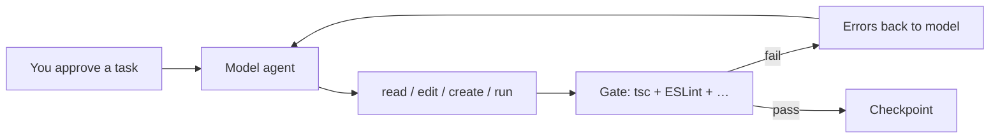

import HarnessBoardDiagram from "../../components/HarnessBoardDiagram.astro";

tsforge is a **TypeScript coding harness**. It sits between you and a model, runs edits in your repo, and keeps asking the model to fix things until your project passes a real check. It is not an editor plugin. You point it at a folder, give it a task, and it drives file changes plus validation until the gate is green or the loop stops.

If you already ran the [Quickstart](/quickstart/), this page explains what you just turned on.

**How to read the docs:** start here, then [How the gate is built](/loop/gate-floor/) when "what counts as done?" is unclear. Use the glossary below when a term looks unfamiliar. Eval and spec pages are for benchmark contributors, not required for day-to-day use.

## What the harness is made of

<HarnessBoardDiagram variant="full" />

The diagram shows **composition** — what subsystems exist. The loop diagram below shows **flow** — what happens on each turn.

## Why tsforge exists

tsforge started as a necessity experiment: could a 27B model running on local hardware produce TypeScript you'd actually merge, if the harness enforced `tsc`, stack rules, and stream-level corrections? It could. That proof shaped every subsystem here.

The project was developed against Qwen 3.6 27B, but that is where the idea was tested, not what the product is for. The same loop works with larger or hosted models. They usually need fewer retries. They still benefit from an external oracle and stack-aware rules.

Guardrails matter most when the model is constrained. They still help when the model is strong.

## The problem it targets

Models in a chat window can write TypeScript fast. They also skip types, paste `as any`, forget your stack conventions, and stop before tests pass. Nothing in the chat UI says "this edit failed `tsc`, try again with these exact errors."

tsforge closes that gap with three ideas:

1. **A gate you can trust.** Work is not done until a shell command exits 0. For TypeScript repos that usually means `tsc --noEmit`, ESLint from tsforge's own strict config, and often tests or format checks. The model sees structured errors, not a vague "something broke."

2. **Feedback while the model still types.** Stream rules (TTSR) can cut off bad tool arguments mid-generation. Hashline edits tie replacements to a file hash so line numbers do not drift. The TypeScript language service can flag a bad write before the next turn.

3. **Stack-aware rules without hand-wiring.** tsforge reads `package.json`, turns on ESLint packs for React, Drizzle, Elysia, and the rest, and runs them on every validation. You get project-specific guardrails without maintaining a separate lint setup for the harness.

## One task, one loop

The **model agent** is the loop driver: it calls tools, applies edits, runs the [repair ladder](/uplift/repair-ladder/) when a tool call is malformed, and re-prompts on gate failure. The **gate** is the oracle: if it fails, the harness feeds the error list back and the model gets another turn.

Caps prevent infinite churn (for example 12 repair cycles, 3 stalled cycles with no progress). Details live in [When the gate fails](/loop/validation/).

## Why TypeScript specifically

tsforge is opinionated about TypeScript because the language gives you machine-checkable truth:

- **`tsc`** is a hard floor. tsforge overlays a strict `tsconfig` so the gate does not inherit a loose upstream config. See [How the gate is built](/loop/gate-floor/).
- **The language server** (same engine as VS Code's TypeScript support) runs in-process for symbol search, rename, and diagnostics on every write. See [TypeScript language server](/lsp/typescript-server/).
- **ESLint packs** encode patterns `tsc` cannot catch (component file layout, no `console.log`, Drizzle query shape, etc.). See [Rule packs](/guardrails/rule-packs/).

For greenfield web apps, the harness stands up the full BoringStack stack (Bun + Elysia + Drizzle API and a Vite/React UI) and builds it resource-by-resource against BoringStack's own gate. See [Greenfield scaffolding](/scaffold/boringstack/).

## Models and deployment

tsforge talks to any OpenAI-compatible HTTP API. Configure endpoints in `~/.tsforge/models.json` or override with environment variables. See [Model adapter](/inference/adapter/).

The default `http://localhost:8000/v1` is a convenience for local inference servers. Point `TSFORGE_BASE_URL` at a hosted API when you want. The gate, packs, and stream rules do not change.

## Doc map (plain language)

| Section | What it covers |
| --- | --- |
| [Interactive CLI](/cli/interactive/) | Day-to-day REPL: slash commands, flags, sessions |
| [Plan mode](/cli/plan-mode/) | Read-only exploration before you let the model edit |
| [How the gate is built](/loop/gate-floor/) | What acceptance check tsforge runs and how it picks tsc + ESLint |
| [When the gate fails](/loop/validation/) | Repair loop, stop conditions, error feedback to the model |
| [TypeScript language server](/lsp/typescript-server/) | Navigation tools and write-time diagnostics |
| [Greenfield scaffolding](/scaffold/boringstack/) | Standing up a new BoringStack full-stack app |
| [Stack detection](/guardrails/stack-detection/) | Which ESLint packs turn on for your dependencies |
| [Rule packs](/guardrails/rule-packs/) | What each pack enforces |
| [Fix bad tool calls](/uplift/repair-ladder/) | Malformed tool JSON fixed before re-asking the model |
| [Safer line edits](/uplift/hashline/) | Line edits anchored to a content hash |
| [Stop bad output early](/uplift/ttsr/) | Forbidden patterns cut off mid-stream |
| [Spec format](/spec/format/) | YAML tasks for benchmarks and regression runs |
| [A/B testing](/eval/ab-testing/) | Comparing harness settings with eval specs |

## Glossary

| Term | Meaning |
| --- | --- |
| **Gate** | Shell command that must pass before tsforge treats work as done. Often `tsc`, ESLint, tests. |
| **Harness** | The tsforge runtime: CLI, loop, gate, guardrails, and model wiring. |
| **LSP / language server** | TypeScript's semantic engine (`LanguageService`): go-to-definition, types, rename, diagnostics. tsforge embeds it; you do not run a separate tsserver process. |
| **TTSR** | **T**ool-**t**ext **s**tream **r**ules. Regex watchers on streaming model output. On match, tsforge aborts the stream and retries with short guidance (for example "no `as any`"). |
| **Hashline** | Edit format `¶path#HASH` plus line ops. The hash proves the file has not changed since the model read it. |
| **Rule pack** | A bundle of ESLint rules keyed to a stack (React, Elysia, Drizzle, …). |
| **Meta-rule** | Cross-cutting ESLint rules tsforge adds on top of packs (import boundaries, test file pairing). |
| **Repair ladder** | L0–L3 fixes for invalid tool calls: unwrap links, coerce types, then re-ask the model. |
| **Spec** | YAML file describing a task, files in scope, and expected gate outcome for evals. |
| **Oracle** | Same as the gate: the external check that decides pass or fail. |
| **REPL** | The interactive CLI session where you type tasks and slash commands. |

## What tsforge is not

- Not locked to localhost. The default endpoint is local; any OpenAI-compatible URL works via [Model adapter](/inference/adapter/).
- Not a replacement for your project's own CI. It can run stricter checks than your repo's `npm run lint` because it ships its own ESLint floor.
- Not magic on non-TypeScript trees. Without `tsconfig`, the gate falls back to ESLint-only.

Ready to run? [Quickstart](/quickstart/). Ready to drive the session? [Interactive CLI](/cli/interactive/).
