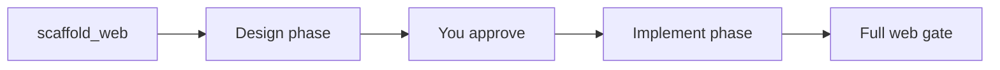

Plan mode is a safety rail for ambiguous work. The model can **read** your repo and **propose** a plan, but it cannot **edit** until you say go.

Use it when you want to see the approach before files change. Skip it for small, obvious edits in an existing repo.

## How to turn it on

- Start with `tsforge --plan`, or type `/plan` mid-session
- When you are ready, reply **`approve`**, **`go`**, or **`lgtm`**
- Web builds also accept **`yes`** / **`ok`** at the design checkpoint

## What the model can do in plan mode

Read tools only:

- `read`, `search`, and LSP navigation (`symbol_search`, `find_references`, `type_at`, `diagnostics`)
- `git_context` — structured, read-only repo history/diffs (see [Git context](/reference/flags/#git-context))
- `run` for **read-only** shell commands (no installs, no writes)

Blocked until approval: `edit`, `create`, `edit_lines`, scaffolders.

## General plan mode

Good for: "explore this repo and tell me how you'd refactor auth" or "what files would you touch for feature X?"

After approval, tsforge switches to the normal implement loop with full write tools.

## Staged web builds

For new apps (`--web` or `scaffold_web`), plan mode splits work into two phases:

1. **Design phase**: types, services, route list. Lighter gate (types + lint, no Vite build yet).
2. **Checkpoint**: model shows the plan; you approve.
3. **Implement phase**: routes and UI get filled in. Full web gate runs.

This catches contract mistakes before UI work piles up.

## When to skip plan mode

- One-line fixes in a repo you already understand
- One-shot runs where `--accept` and the gate drive completion

→ [Web scaffolding](/scaffold/web/) · [Interactive CLI](/cli/interactive/)
