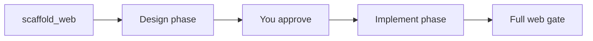

Plan mode is a safety rail for ambiguous work. The model can **read** your repo and **propose** a plan, but it cannot **edit** until you say go.

**It is the default for a fresh interactive session** — tsforge explores, asks the few clarifying questions that matter, and proposes a plan before it writes anything. The status bar shows the current mode as a `◆ plan` / `◆ normal` chip.

## Switching modes

- Press **Shift+Tab** to cycle the mode (plan → normal → …), or type **`/plan`** to toggle it
- When the plan looks right, reply **`approve`**, **`go`**, or **`lgtm`** — the model implements it
- Web builds also accept **`yes`** / **`ok`** at the design checkpoint

There is no disable *flag*: it's a mode you cycle with Shift+Tab. (`tsforge --plan` still forces it on for a one-off launch.)

## What the model can do in plan mode

Read tools only:

- `read`, `search`, and LSP navigation (`symbol_search`, `find_references`, `type_at`, `diagnostics`)
- `git_context` — structured, read-only repo history/diffs (see [Git context](/reference/flags/#git-context))
- `run` for **read-only** shell commands (no installs, no writes)

Blocked until approval: `edit`, `create`, `edit_lines`, scaffolders.

## General plan mode

Good for: "explore this repo and tell me how you'd refactor auth" or "what files would you touch for feature X?"

After approval, tsforge switches to the normal implement loop with full write tools.

## Staged web builds

For new apps (`--web` or `scaffold_web`), plan mode splits work into two phases:

1. **Design phase**: types, services, route list. Lighter gate (types + lint, no Vite build yet).
2. **Checkpoint**: model shows the plan; you approve.
3. **Implement phase**: routes and UI get filled in. Full web gate runs.

This catches contract mistakes before UI work piles up.

## Leaving plan mode

- **Shift+Tab** (or `/plan`) drops to normal mode for hands-on edits in a repo you know
- One-shot runs (`tsforge "task" --accept …`) and headless/eval runs are autonomous already — plan mode is interactive-only, since it needs a human to approve

→ [Web scaffolding](/scaffold/web/) · [Interactive CLI](/cli/interactive/)
