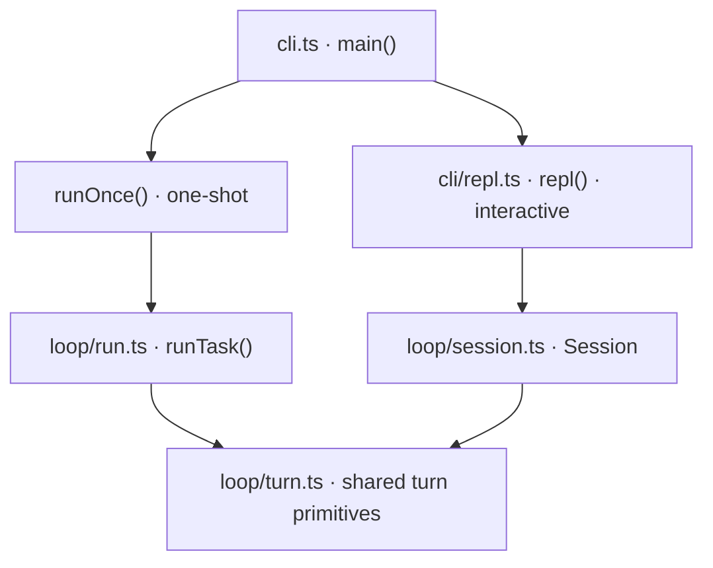
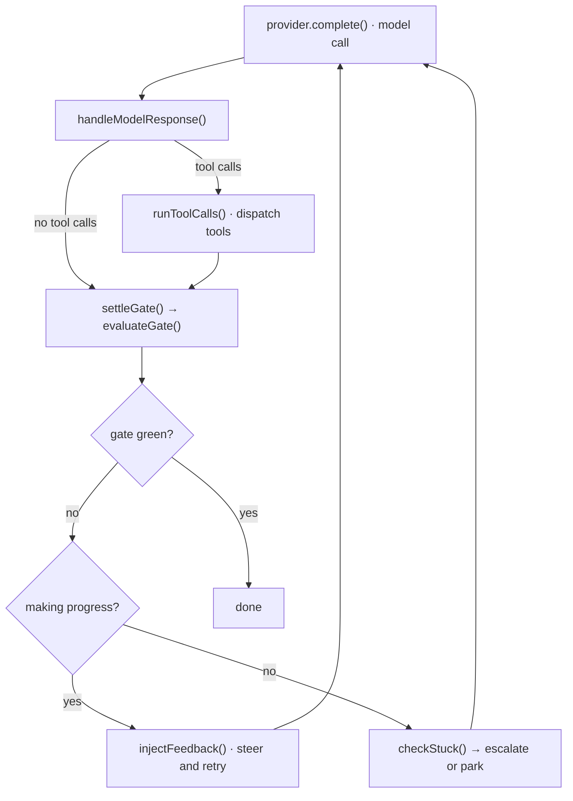

This is the page for tracing a bug. It follows one task from the command line to a green
gate, naming the function at each step. Paths are relative to `packages/core/src/`.

## Two entry paths, one engine

`cli.ts` parses arguments and picks a mode. Everything then converges on the same turn
primitives in `loop/turn.ts` — the headless and interactive paths differ in who supplies
the next instruction, not in how work gets done.

`loop/turn.ts` is the shared floor: `toolsFor()` decides which tools are offered,
`runToolCalls()` executes them, `evaluateGate()` runs the gate, and `settleGate()` decides
what the result means. Both drivers call all four.

## The turn loop

`runTask()` (`loop/run.ts`) does the setup — `redPrecheck()` confirms the gate actually
fails before starting, `resolveStackForRun()` detects the stack and loads conventions,
`buildTsService()` starts the language service — then hands off to `runMainLoop()`.

Each turn:

The rule that keeps this honest: **every workspace mutation re-runs the gate.** A tool
that writes without surfacing `mutated` on its event lets a stale green be reported as
finished work. That invariant is why adding a tool means touching `runToolCalls()`'s
accounting, not just writing a handler.

## Deciding it is stuck

Green is easy. The interesting logic is what happens when it is not.

`settleGate()` calls `evaluateGate()` — autofix, then the gate command, then meta-rules —
and compares the result against the previous turn. `trackNetProgress()` and
`trackErrorAges()` feed `checkStuck()`, which distinguishes *slow* from *stalled*: an
error count that keeps falling is progress even if it is slow, while the same error set
turn after turn is not.

When it is stalled, `injectFeedback()` climbs a ladder rather than repeating itself. The
rungs are `EscalationRung` in `loop/loop.types.ts`, built by `buildSteerMessage()` in
`loop/feedback/steer.ts`:

| Rung | What changes |
| --- | --- |
| R1 | Make the model diagnose its own failure before editing again (`handleR1Diagnosis`) |
| R2 | Give it more room to reason |
| R3 | Narrow the change — one file, one error |
| R4 | Hand off to an expert model (`tryExpertRescue`, gated by `shouldTryExpertRescue`) |

If the ladder runs out, the run parks with a handoff (`buildHandoffAsk`) describing what
was tried, so a later session resumes instead of restarting.

## Not losing good work

Two mechanisms guard against a run that gets close and then wanders off:

- **Near-green checkpointing** — `captureNearGreenCheckpoint()` snapshots the best state
  seen; `rollbackNearGreen()` restores it if later turns spray new errors.
- **Autofix before judging** — `autoFixStep()` clears mechanically fixable errors first,
  so the model's attention goes to the ones that need thought.

`polishOnGreen()` runs once the gate passes, and `consolidateLessons()` mines the run for
failure-to-fix patterns that inform later runs.

## Where the stack-specific parts attach

Everything above is stack-agnostic. Scaffolding, what an error *means*, and how a feature
is verified all arrive through the adapter seams — see
[Adapters and seams](/internals/seams/). The core loop cannot import an adapter; an
ESLint rule fails the build if it tries.
