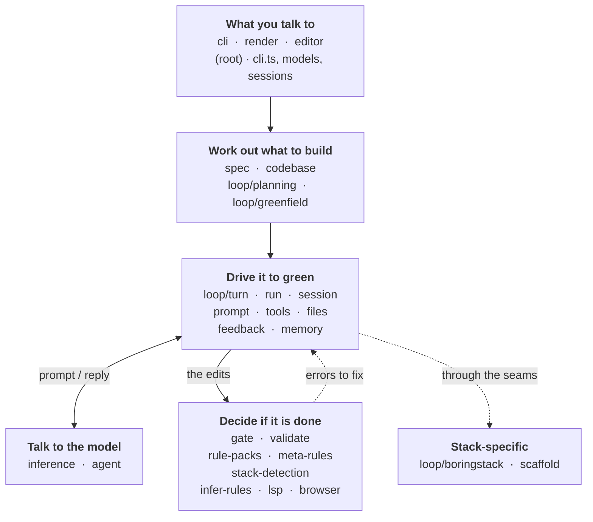

These pages are about the harness **codebase**, not about using tsforge. They exist so
that opening `packages/core` for the first time, or the first time in a month, does not
start with rediscovery.

For what tsforge is and how it is layered conceptually, start with
[Big picture](/big-picture/) instead.

## The whole system

Every subsystem in `packages/core/src`, grouped by the job it does. A task enters at the
top and moves down; the loop and the gate pass work back and forth until it is green.

Read it as a pipeline with one loop in it. Everything above **Decide if it is done**
works out *what* to write. That box decides *whether it counts*, and the dotted line back
is the whole harness: the gate hands errors to the loop, the loop tries again, until
nothing comes back.

Four subsystems sit under all of it rather than in the flow: **lib** (fs, json, guards,
globs), **config** (project config, profiles, recipes), **policy** (what an action is
allowed to do), and **constitution** (the baseline system role).

Seven more never run during an ordinary build: **eval** and **self-harness** (measuring
and improving the harness itself), **reviewers** (the independent review panel),
**proptest**, **setup**, **mcp**, and **architecture** (which generates the
[subsystems map](/internals/subsystems/)).

## Start here

| If you want to | Read |
| --- | --- |
| Change something and need the files | [Where do I change X?](/internals/where-to-change/) |
| Trace a bug through a run | [How a run executes](/internals/control-flow/) |
| See every subsystem and how they couple | [Subsystems](/internals/subsystems/) |
| Add support for a new stack | [Adapters and seams](/internals/seams/) |

## What is generated

[Subsystems](/internals/subsystems/) is produced from source by `bun run arch:build` and
committed as `packages/core/ARCHITECTURE.md`. CI fails if the committed copy drifts from
what the code would generate, so its file counts, dependency edges, cycles, entry points
and seam locations are accurate by construction rather than by discipline.

It also refuses to build when a directory appears under `src/` with no entry in
`subsystem-registry.ts`. A new subsystem cannot land without someone saying what it is.

The other three pages are hand-written. They carry intent, which no generator can derive.

## Related, in the repo

`docs/harness-subsystems.md` is a different artifact for a different job: a **review
manifest**, listing per-subsystem invariants, risk areas and a P1/P2/P3 checklist. It is
what the `harness-review` skill reads when auditing a subsystem. Reach for it when you
are checking whether the code still upholds its contracts; reach for these pages when you
are trying to find or change something.
