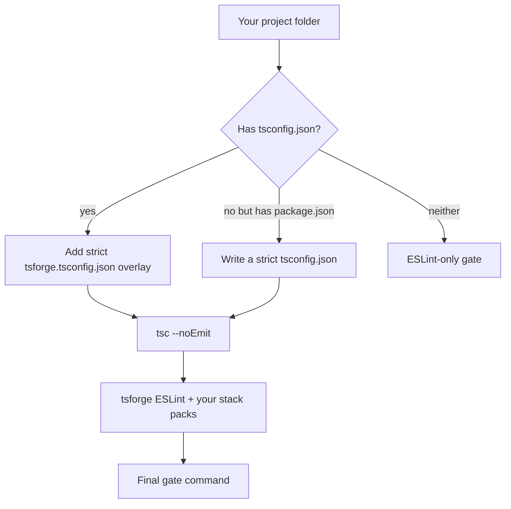

When you start tsforge on a project, it needs an answer to one question: **how do we know the work is actually done?**

That answer is the **gate**: a shell command that must exit with code 0. If it fails, the model gets the errors and tries again. If it passes, tsforge treats the task as complete.

This page explains how tsforge **chooses** that command when you do not set one yourself.

## The gate in practice

Example gate for a typical TypeScript repo:

```bash
tsc --noEmit -p tsforge.tsconfig.json && eslint --max-warnings 0 …
```

You do not have to memorize this. tsforge builds something like it automatically.

You can override anytime:

| You type | Effect |
| --- | --- |
| `/gate bun test` | use your command for the rest of the session |
| `tsforge "task" --accept "bun test"` | one-shot run with a custom gate |
| `--no-gate` | skip auto-detection (advanced) |

See [When the gate fails](/loop/validation/) for what happens when the gate fails and how the repair loop stops.

## What tsforge looks at first



Three common cases:

**Existing TypeScript repo** (you already have `tsconfig.json`). tsforge writes `tsforge.tsconfig.json` that extends yours and turns on strict flags tsforge cares about (`strict`, `noUncheckedIndexedAccess`, and similar). Your original file stays untouched.

**New project with `package.json` but no tsconfig yet**. tsforge writes a full strict `tsconfig.json` so the model cannot slip through on loose settings.

**Not really a TypeScript project**. No `tsc` step. The gate is ESLint-only.

## TypeScript check (`tsc`)

`tsc --noEmit` means "typecheck everything, do not emit JavaScript files."

tsforge does **not** trust a loose upstream tsconfig. Even if your repo allows sloppy settings, the gate uses tsforge's strict overlay. That is intentional: the harness is opinionated about merge-ready TypeScript.

## ESLint check

After typecheck, tsforge runs **its own** ESLint setup. It does **not** run your project's `npm run lint` script.

Why separate? tsforge ships rules tuned for AI-written code and your stack (React, Drizzle, Elysia, etc.). Those rules come from [Rule packs](/guardrails/rule-packs/) enabled by [Stack detection](/guardrails/stack-detection/). Tune them with a [profile](/guardrails/config/#profiles) or per-rule overrides in [tsforge.config.json](/guardrails/config/).

The core ESLint config is **syntactic-only** (no type-aware rules) so it runs on any `.ts` file without the target's full type graph. With **`profile: "strict"`** and an existing `tsconfig.json`, tsforge adds a second pass for async correctness (`no-floating-promises`, `no-misused-promises`).

Baseline stylistic rules (all stacks) include blank lines before `return` and around block-like statements via `@stylistic/padding-line-between-statements`. These are auto-fixable — the gate's `eslint --fix` applies them without model intervention.

## Web apps get a longer gate

If the session scaffolds a new browser app (`scaffold_web` or `tsforge --web`), the gate grows. "Done" then roughly means: Vite build passes, types pass, lint passes, route stubs are filled in, formatting is clean, and a headless browser smoke test passes.

Details: [Web scaffolding](/scaffold/web/).

Add a one-off page render check with `--browser path/to/index.html`.

## Two kinds of checking

Do not confuse these:

**Session gate** (this page). Runs when tsforge decides whether a task is finished. One command, exit 0 or not.

**Write-time feedback** (faster, per edit). After each `edit` or `create`, tsforge can show type errors on that file immediately, before the full gate runs. See [Write diagnostics](/uplift/write-diagnostics/) and [TypeScript language server](/lsp/typescript-server/).

Write-time feedback helps the model fix mistakes early. The session gate is still the final word.

→ [Big picture](/big-picture/) · [When the gate fails](/loop/validation/) · [Interactive CLI](/cli/interactive/)
