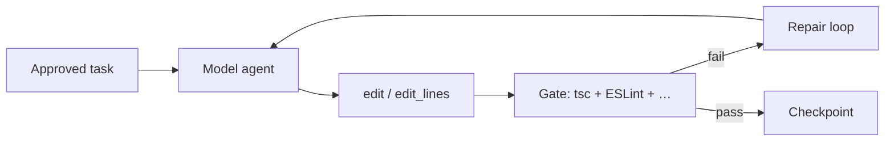

From install to a running loop in a few minutes. For the why behind each step, read [Big picture](/big-picture/) first.

## Before you start

tsforge runs **shell commands** and **writes files** in the project you point it at. Use it only on repos you trust, or inside a sandbox.

You need **Bun** ≥ 1.3.14 and an OpenAI-compatible model endpoint (local server or hosted API).

## 1. Install tsforge

**Recommended** (install script: Bun if missing, then tsforge from npm or GitHub):

```bash
curl -fsSL https://tsforge.dev/install.sh | bash
```

**Or** with Bun directly (from [npm](https://www.npmjs.com/package/@agjs/tsforge)):

```bash
bun install -g @agjs/tsforge
```

**From source** (contributors and bleeding edge):

```bash
git clone https://github.com/agjs/tsforge.git
cd tsforge
bun install
bun link --global --cwd packages/core   # installs `tsforge` on PATH
# or without global link:
bun run tsforge
```

If `tsforge` is not found after install, add Bun's global bin directory to your PATH:

```bash
export PATH="$(bun pm bin -g):${PATH}"
```

## 2. Configure the model registry

```bash
mkdir -p ~/.tsforge
cat > ~/.tsforge/models.json <<'EOF'
{
  "active": "qwen-local",
  "models": {
    "qwen-local": {
      "baseUrl": "http://localhost:8000/v1",
      "model": "qwen3.6-27b",
      "thinking": true
    }
  }
}
EOF
```

Override per-run with `TSFORGE_BASE_URL` and `TSFORGE_MODEL`. See [Environment variables](/reference/flags/).

## 3. Run the CLI

```bash
tsforge
```

Point tsforge at your target project when prompted, or pass `--dir`. See [Interactive CLI](/cli/interactive/) for slash commands, flags, and session persistence.

## The loop (short version)



The **gate** is the acceptance check tsforge builds from your project ([How the gate is built](/loop/gate-floor/)). On existing repos the embedded TypeScript language server adds navigation tools and write-time diagnostics ([Language server](/lsp/typescript-server/)).

## What to read next

| If you are… | Start here |
| --- | --- |
| Still orienting | [Big picture](/big-picture/) |
| Driving the REPL day to day | [Interactive CLI](/cli/interactive/) |
| Building a new Vite/React app | [Web scaffolding](/scaffold/web/) + [Plan mode](/cli/plan-mode/) |
| Running benchmark specs | [Spec format](/spec/format/) |
| Tuning ESLint enforcement | [Stack detection](/guardrails/stack-detection/) · [Rule catalog](/reference/rules-catalog/) |
| Measuring feature wins | [A/B testing](/eval/ab-testing/) |
